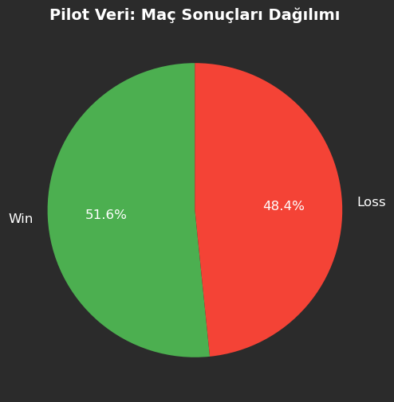

# DSA 210: Quantitative Analysis of Personal Clash Royale Performance
**Student:** Atakan Çelikhisar  
**Date:** April 13, 2026

## 1. Academic Integrity & AI Disclosure
In accordance with the course guidelines, I declare that Generative AI was used as an assistant in this project stage.
* **Usage:** AI was consulted for building the incremental data fetching pipeline, structuring the data parsing logic, and selecting the appropriate statistical test (Binomial Test) for the pilot study.
* **Human Input:** All data is personal and retrieved from my own player account (#U822RU2P). The project direction and final interpretations are my own.

## 2. Data Collection & Pilot Study
I have established an automated data collection pipeline using the **Clash Royale Developer API**. 
* **Incremental Fetching:** Since the API only returns the most recent battles, a Python script was developed to periodically fetch and store unique match records in `atakan_clash_data.json`.
* **Pilot Dataset:** For this EDA stage, a pilot dataset of **31 matches** has been successfully collected and validated.
* **Target:** I aim to collect **500-1,000 matches** by the final deadline for more robust analysis.

## 3. Exploratory Data Analysis (EDA)
Initial analysis focused on the Win/Loss distribution of the pilot dataset.

**Key Findings:**
* **Total Decisive Matches:** 31
* **Win Rate:** 51.6%
* **Loss Rate:** 48.4%
The distribution shows a balanced but slightly positive performance in the current meta.

## 4. Hypothesis Testing
To fulfill the requirement for statistical analysis, a preliminary **One-Sample Binomial Test** was conducted on the pilot data.

* **Null Hypothesis ($H_0$):** My true win rate is 50% ($p = 0.5$).
* **Alternative Hypothesis ($H_a$):** My true win rate is greater than 50% ($p > 0.5$).

**Test Results (n=31):**
* **Observed Wins:** 16
* **P-Value:** 0.4286
* **Conclusion:** Since the p-value (0.4286) is greater than the significance level ($\alpha = 0.05$), we **fail to reject the null hypothesis**. At this stage, there is not enough statistical evidence to claim a win rate significantly above 50%. This highlights the need for a larger dataset (e.g., 500+ matches) to achieve statistical power.

## 5. Next Steps
- Continue running the incremental fetcher to increase sample size.
- Analyze the correlation between "Average Elixir Cost" and match outcomes.
- Perform hypothesis tests on specific deck archetypes.
